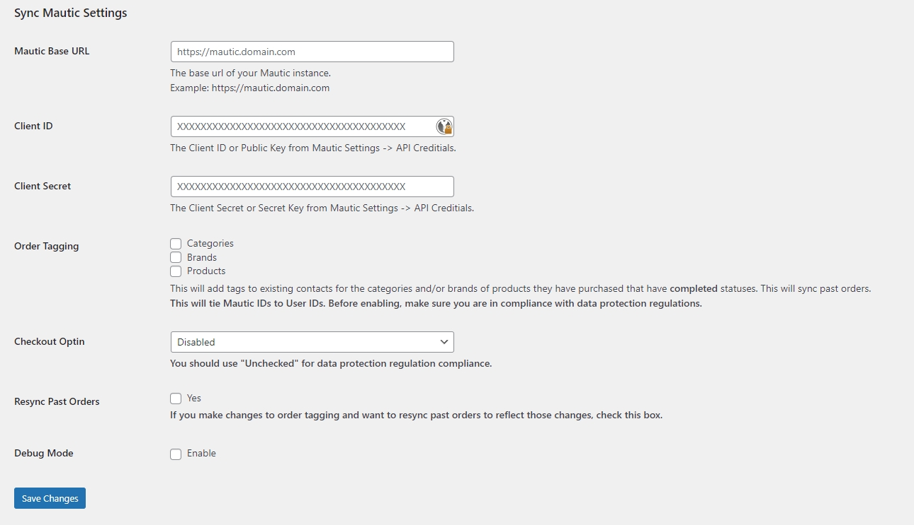

## Description

Mautic is an excellent Open Source Email and SMS marketing tool, but it lacks the ability to see what your contacts have purchased or if they came from your website. Sync Mautic works with WordPress to tag those subscribed via your website and also with WooCommerce so that when a customer completes an order and they are subscribed as a contact, it will automatically tag them with the products, categories, and brands they have purchased. Our plugin also provides an endpoint you can hook into for OptinMonster to collect leads, but if you don't use OptinMonster we provided a [mautic_form] shortcode to use which will inject a form that links to your Mautic instance.

### Features

- Supports WordPress
- Supports WooCommerce
- Supports OptinMonster using /wp-json/sync-mautic/v1/optinmonster
- Supports adding leads using /wp-json/sync-mautic/v1/add-lead
- Adds [mautic_form] shortcode to give an email signup. You can use the tag attribute to add tags in Mautic [mautic_form tag="Tag 1, Tag 2"]
- Adds a checkbox to WooCommerce checkout to subscribe to newsletter
- Tag users of your website in Mautic
- Tag customers of your store in Mautic
- Tag subscribed contacts with products they purchase
- Tag subscribed contacts with categories they have purchased from
- Tag subscribed contacts with brands they have purchased from

## Installation

1. Backup your WordPress site.
2. Upload the plugin files to the `/wp-content/plugins/` directory, or install the plugin through the WordPress plugins screen directly.
3. Activate the plugin through the 'Plugins' screen in WordPress.

## Screenshots

## Changelog

### 1.0.5
- Added: Ability to add multiple tags using [mautic_form tag="Tag 1, Tag 2"] shortcode.
- Added: API connection test when saving Sync Mautic settings, which will trigger an error if it fails to connect.
- Added: Order meta to track if the customer signed up for the newsletter.
- Added: Additional error logging.
- Bugfix: After updating settings, it will pass the old token until cache expires. Saving settings will now clear the cache.
- Bugfix: After the token expires, it fails to clear cache the first time it attempts to connect.

### 1.0.4
- Added: Additional debugging to checkout lead
- Removed: WooCommerce init method

### 1.0.3
- Added: Old rest routes for those previously on the beta
- Updated: Handling for beta compatibility

### 1.0.2
- Bugfix: Empty tag added into Mautic when the shortcode's tag attribute was empty.
- Added: Beta compatibility check for shortcode so previous beta users do not need to update their shortcode.

### 1.0.1
- Bugfix: Saving Settings

### 1.0.0
- Initial Release